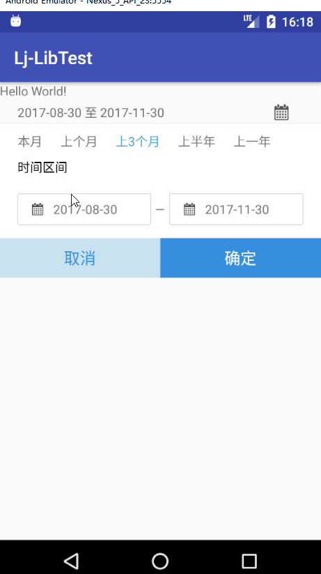

# 日期选择控件

- 可以选择本月，上个月，上三个月，上半年，上一年以及其他日期


## 使用方法

复制aar文件到app/libs文件夹中

在App的build.gradle

```
android{
  ...
  repositories{
        flatDir{
            dirs 'libs'
        }
    }
  ...
}

...
dependencies{
  ...
  compile (name:'ljdatepicker',ext:'aar')
  ...
}
```


